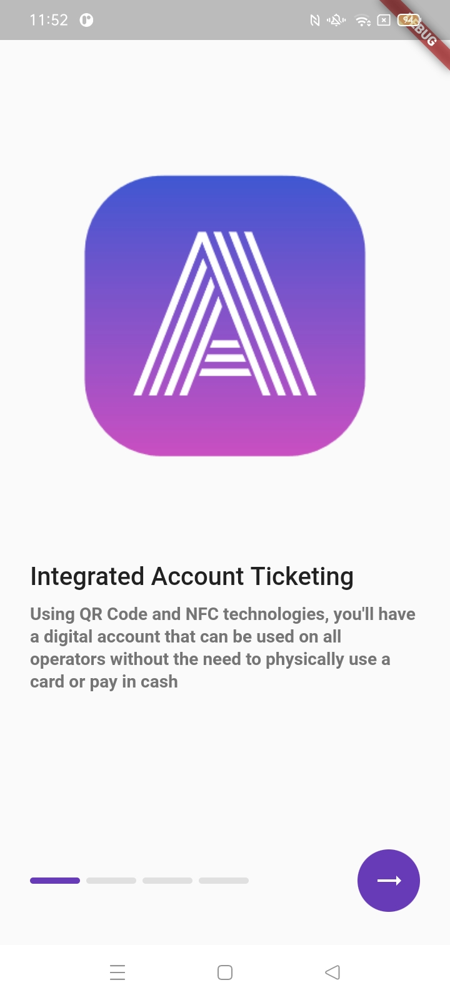
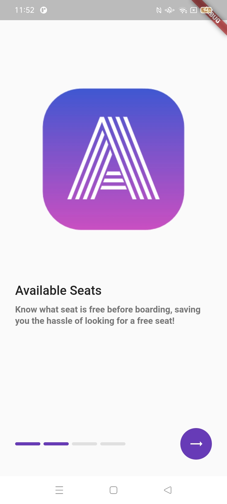
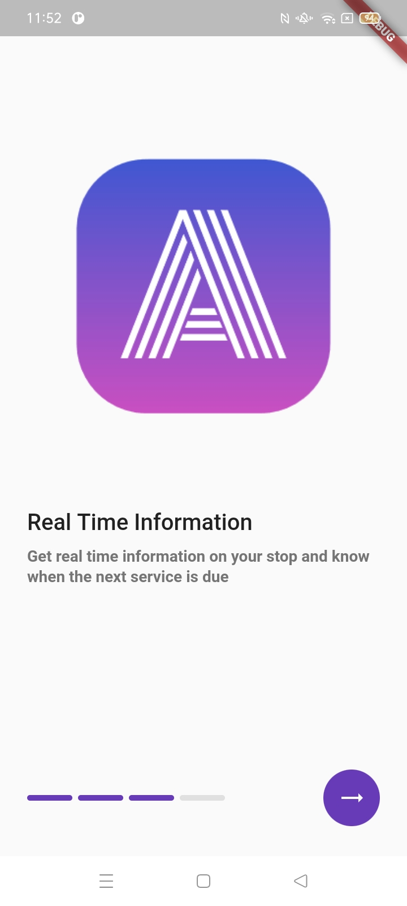
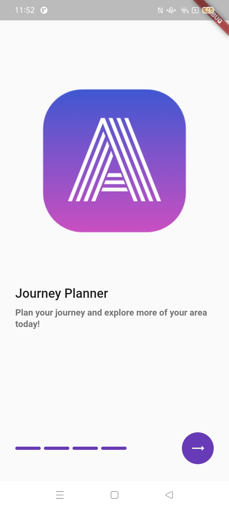
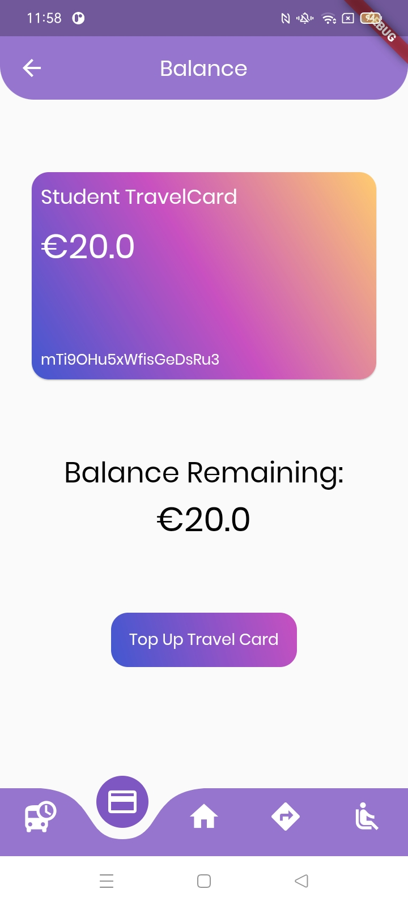
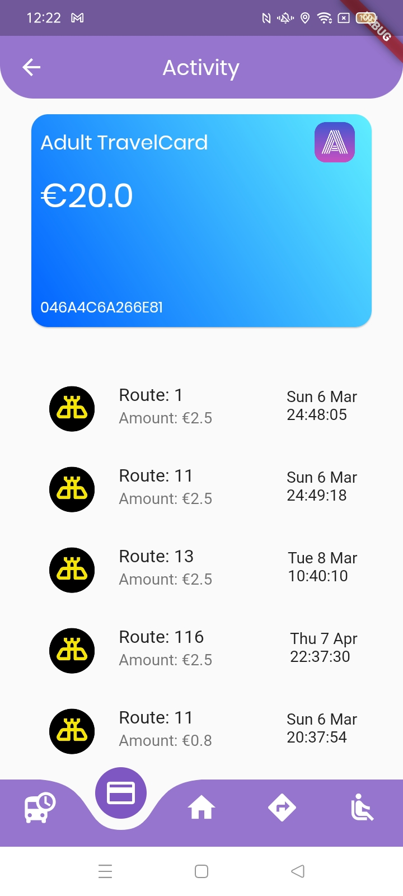

<div align="center">
  <!--  -->
  <h1>Anseo Transit</h1>
  
</div>

---

<div align="center">
  <h4>
    <a href="../Video Demonstration">View Demo</a>
    <span> · </span>
    <a href="https://anseo.gitbook.io/anseo-documentation/">Documentation</a>
  </h4>
</div>

---

<!-- Table of Contents -->

# :notebook_with_decorative_cover: Table of Contents

- [Features](#dart-features)
- [Getting Started](#toolbox-getting-started)
- [Screenshots](#iphone-screenshots)
  - [Introduction / Authentication](#one-introduction-authentication)
  - [Home](#two-home)
  - [Ticket](#three-ticket)
  - [Plan Route](#four-plan-route)
  - [Real Time](#five-real-time)
  - [Available Seats](#six-available-seats)
- [Directory Structure](#file_folder-directory-structure)
- [System Design](#triangular_ruler-system-design)
  - [Methodology](#traffic_light-methodology)
  - [Three Tier Architecture](#office-three-tier-architecture)
  - [Database](#cd-database)
  - [USE Case](#performing_arts-use-case)
  - [Colour Scheme](#art-colour-scheme)
- [Plugins](#electric_plug-plugins)
- [Development Process](#construction-development-process)

---

<!-- Features -->

## :dart: Features

- [x] Integrated Account Based Ticketing
- [x] View Available Seating on board a fleet
- [x] Real Time Information on multiple modes of public transportation
- [x] Determine optimal route between two locations using multiple modes of transportation

---

<!-- Getting Started -->

## :toolbox: Getting Started

Have a look at the documentation [here](https://anseo.gitbook.io/anseo-documentation/) to get started.

---

<!-- Screenshots -->

## :iphone: Screenshots

<!-- Introduction / Authentication-->

### :one: Introduction / Authentication

|                                          Splash Screen                                           |                                               Walkthrough                                               |                                               Walkthrough                                               |
| :----------------------------------------------------------------------------------------------: | :-----------------------------------------------------------------------------------------------------: | :-----------------------------------------------------------------------------------------------------: |
|  |  |  |

|                                               Walkthrough                                               |                                               Walkthrough                                               |                                          Landing Page                                           |
| :-----------------------------------------------------------------------------------------------------: | :-----------------------------------------------------------------------------------------------------: | :---------------------------------------------------------------------------------------------: |
|  |  |  |

|                                          Sign In                                           |                                           Sign Up                                            |                                           Sign Up                                            |
| :----------------------------------------------------------------------------------------: | :------------------------------------------------------------------------------------------: | :------------------------------------------------------------------------------------------: |
|  |  |  |

<!-- Home -->

### :two: Home

|                                 Sign In                                 |                                 Sign Up                                 |                                 Sign Up                                 |
| :---------------------------------------------------------------------: | :---------------------------------------------------------------------: | :---------------------------------------------------------------------: |
|  |  |  |

<!-- Ticket -->

### :three: Ticket

|                                Ticket Overview                                |                                Travel Card Overview                                |                                Add Travel Card or Ticket Option                                 |
| :---------------------------------------------------------------------------: | :--------------------------------------------------------------------------------: | :---------------------------------------------------------------------------------------------: |
|  |  |  |

|                                Add Travel Card                                |                                 Add Ticket                                 |                                 Add Ticket                                 |
| :---------------------------------------------------------------------------: | :------------------------------------------------------------------------: | :------------------------------------------------------------------------: |
|  |  |  |

|                                 Add Ticket                                 |                                Use Travel Card or Ticket QR Code                                |                                Delete Travel Card                                |
| :------------------------------------------------------------------------: | :---------------------------------------------------------------------------------------------: | :------------------------------------------------------------------------------: |
|  |  |  |

|                                 Top Up Travel Card                                 |                                 Top Up Travel Card                                 |                                 Top Up Travel Card                                 |
| :--------------------------------------------------------------------------------: | :--------------------------------------------------------------------------------: | :--------------------------------------------------------------------------------: |
|  |  |  |

|                                Balance                                |                                Activity                                |
| :-------------------------------------------------------------------: | :--------------------------------------------------------------------: | ---------------------------------------------------------------------------------- |
|  |  |  |

<!-- Plan Route -->

### :four: Plan Route

|                                   Plan Route                                   |                                   Plan Route                                   |                                   Plan Route                                   |                                   Plan Route                                   |
| :----------------------------------------------------------------------------: | :----------------------------------------------------------------------------: | :----------------------------------------------------------------------------: | :----------------------------------------------------------------------------: |
|  |  |  |  |

<!-- Real Time -->

### :five: Real Time

|                                    Real Time Options                                    |                                  Search by Stop Number                                   |                                  Search by Stop Number                                   |
| :-------------------------------------------------------------------------------------: | :--------------------------------------------------------------------------------------: | :--------------------------------------------------------------------------------------: |
|  |  |  |

|                                  Search by Stop Address                                   |                                  Search by Stop Address                                   |                                  Search by Map                                   |
| :---------------------------------------------------------------------------------------: | :---------------------------------------------------------------------------------------: | :------------------------------------------------------------------------------: |
|  |  |  |

|                                  Search by Map                                   |                                 Real Time Results                                  |
| :------------------------------------------------------------------------------: | :--------------------------------------------------------------------------------: |
|  |  |

<!-- Available Seats -->

### :six: Available Seats

|                                     Search by Map                                      |
| :------------------------------------------------------------------------------------: |
|  |

---

<!-- Directory Structure -->

## :file_folder: Directory Structure

<details>
     <summary> Anseo Transit </summary>
  
```
|-- lib
|   |-- config
|   |   |-- extensions.dart
|   |   '-- theme.dart
|   |-- model
|   |   |-- map_marker.dart
|   |   |-- real_time_information.dart
|   |   |-- record.dart
|   |   |-- search_direction.dart
|   |   |-- search_routes.dart
|   |   |-- search_stop.dart
|   |   |-- ticket.dart
|   |   |-- transactions.dart
|   |   |-- travel_card.dart
|   |   '-- user.dart
|   |-- pages
|   |   |-- authentication
|   |   |   |-- landing_page.dart
|   |   |   |-- sign_in.dart
|   |   |   '-- sign_up.dart
|   |   |-- help
|   |   |   '-- help.dart
|   |   |-- home
|   |   |   |-- home.dart
|   |   |   |-- root_navigation.dart
|   |   |   '-- user_account.dart
|   |   |-- plan_route
|   |   |   '-- plan_route.dart
|   |   |-- real_time
|   |   |   |-- available_seats.dart
|   |   |   |-- real_time_results.dart
|   |   |   |-- real_time.dart
|   |   |   |-- route_direction.dart
|   |   |   |-- route_stops.dart
|   |   |   |-- search_by_route.dart
|   |   |   |-- search_by_stop_address.dart
|   |   |   |-- search_by_stop_number.dart
|   |   |   '-- search_on_map.dart
|   |   |-- ticket
|   |   |   |-- activity.dart
|   |   |   |-- add_ticket.dart
|   |   |   |-- add_travel_card_ticket.dart
|   |   |   |-- add_travel_card.dart
|   |   |   |-- balance.dart
|   |   |   |-- capping.dart
|   |   |   |-- ticket_overview.dart
|   |   |   |-- top_up_travel_card.dart
|   |   |   '-- use_travel_card_ticket.dart
|   |   |-- walkthough
|   |   |   '-- walkthrough.dart
|   |   '-- firebase_wrapper.dart
|   |-- providers
|   |   '-- walkthrough_provider.dart
|   |-- services
|   |   |-- aes_encryption.dart
|   |   |-- firebase_auth.dart
|   |   '-- firebase_database.dart
|   |-- widgets
|   |   |-- available_seat.dart
|   |   |-- colour_type.dart
|   |   |-- ndef_record.dart
|   |   |-- unavailable_seat.dart
|   |   |-- walkthrough_progress_indicator.dart
|   |   '-- walkthrough_template.dart
|   '-- main.dart
|-- assets
|   |-- gtfs
|   |   |-- routes
|   |   |   |-- dublinBusRoutes.json
|   |   |   |-- goAheadRoutes.json
|   |   |   |-- iarnrodEireannRoutes.json
|   |   |   '-- luasRoutes.json
|   |   |-- stops
|   |   |   |-- dublinBusStops.json
|   |   |   |-- goAheadStops.json
|   |   |   |-- iarnrodEireannStops.json
|   |   |   '-- luasStops.json
|   |   |-- trips
|   |   |   |-- dublinBusTrips.json
|   |   |   |-- goAheadTrips.json
|   |   |   |-- iarnrodEireannTrips.json
|   |   |   '-- luasTrips.json
|   |   |-- extensions.dart
|   |   '-- theme.dart
|   |-- icons
|   |   |-- account.png
|   |   |-- activity.png
|   |   |-- add.png
|   |   |-- address.png
|   |   |-- adult.png
|   |   |-- back.png
|   |   |-- balance.png
|   |   |-- capping.png
|   |   |-- child.png
|   |   |-- delete.png
|   |   |-- forward.png
|   |   |-- journey_planner.png
|   |   |-- map_marker.png
|   |   |-- numbers.png
|   |   |-- real_time.png
|   |   |-- route.png
|   |   |-- seat.png
|   |   |-- stop.png
|   |   |-- ticket.png
|   |   |-- top_up.png
|   |   |-- travel_card.png
|   |   |-- use.png
|   |   '-- verified.png
|   |-- logo
|   |   '-- logo1_500.png
|   '-- theme.dart
|-- functions
|   '-- index.js
|-- available_seats.py
|-- pubspec.yaml
```

</details>

---

<!-- System Design -->

## :triangular_ruler: System Design

### :traffic_light: Methodology

Feature Driven Development (FDD), a part of the Agile Methodology, organizes software development around making progress on features in a systematically manner. This was the chosen methodology used in this application as FDD supports the dynamic evolvement of a feature including the inclusion and/or removal of designs and code, and the overall direction of the project.

Given how this project has multiple features to develop, it will allow for each feature to be developed thoroughly with a specific timeframe using sub-features.

To compensate for the potential decrease in documentation, a daily log with all the progress made regarding each feature will be written out whenever a development is being carried out.

Using GitHub as the choice for version control will also provide documentation on any changes that has occurred.

---

### :office: Three Tier Architecture

Anseo Transit is build upon a three-tier architecture model, as show above. With three-tier architecture, it's advantageous in that any changes made to one tier shouldn’t affect any other tiers in theory. The diagram shows the entities within each layer

<div align="center"> 
  
</div>

---

### :cd: Database

Firebase Cloud Firestore, a NoSQL database, will be implemented to store user, travel card and ticket information. The following Entity Relationship Diagram highlight the fields necessary to create the database.

<div align="center"> 
  
</div>

---

### :performing_arts: USE Case

Use Case Diagrams were created to represent the how the system would behave in line with the users interaction. It demonstrates the compulsory and extendable functionality that is applicable to the user when interacting with the system. In this case there is three actors – the commuter, the bus driver/operator and the admin. Each actor has access to certain functionalities and may share common functionalities with other actors.

<div align="center"> 
  
</div>

---

### :art: Colour Scheme

<h4> Main Application</h4>

| Color            | Hex                                                                                                                               |
| ---------------- | --------------------------------------------------------------------------------------------------------------------------------- |
| Primary Color    |  #673AB7                                                                  |
| Secondary Color  |  #9575CD                                                                  |
| Background Color |  #FFFFFF                                                                  |
| Accent Color     |  #9FA8DA                                                                  |
| Icon Gradient    |  #1A6DFF  #C822FF |
| Text Color       |  #000000                                                                  |

---

<h4> Travel Cards </h4>

| Color               | Hex                                                                                                                                                                                                          | Result                                                                                  |
| ------------------- | ------------------------------------------------------------------------------------------------------------------------------------------------------------------------------------------------------------ | --------------------------------------------------------------------------------------- |
| Student Travel Card |  #4158D0 </br> #C850C0 </br> #FFCC70 |  |
| Adult Travel Card   |  #0061FF </br> #60EFFF                                                                       |      |
| Child Travel Card   |  #8EC5FC </br> #E0C3FC                                                                       |      |

---

<h4> Logo </h4>

<table>
<tr><th>Colour</th><th>Result</th></tr>
<tr><td>

| Color           | Hex                                                                                                                               |
| --------------- | --------------------------------------------------------------------------------------------------------------------------------- |
| Logo Background |  #4158D0  #C850C0 |
| Logo Text       |  #FFFFFF                                                                  |

</td><td>


</td></tr> </table>

---

<!--Plugins -->

## :electric_plug: Plugins

| Name                                                                                  | Version             | Usage                                                                                                                           |
| ------------------------------------------------------------------------------------- | ------------------- | ------------------------------------------------------------------------------------------------------------------------------- | --- |
| [**firebase_core**](https://pub.dev/packages/firebase_core)                           | ^1.12.0             | Enables connecting to multiple Firebase apps                                                                                    |     |
| [**firebase_auth**](https://pub.dev/packages/firebase_auth)                           | ^3.3.6              | Enabling Android and iOS authentication using passwords, phone numbers and identity providers like Google, Facebook and Twitter |     |
| [**cloud_firestore**](https://pub.dev/packages/cloud_firestore)                       | ^3.1.7              | Use the Cloud Firestore API a cloud-hosted, noSQL database with live synchronization                                            |     |
| [**provider**](https://pub.dev/packages/provider)                                     | ^6.0.2              | Dependency injection and state management                                                                                       |     |
| [**qr_flutter**](https://pub.dev/packages/qr_flutter)                                 | ^4.0.0              | QR code rendering                                                                                                               |     |
| [**encrypt**](https://pub.dev/packages/encrypt)                                       | ^5.0.1              | Generate cryptographically secure random keys and IVs                                                                           |     |
| [**carousel_slider**](https://pub.dev/packages/carousel_slider)                       | ^4.0.0              | Carousel slider widget                                                                                                          |     |
| [**http**](https://pub.dev/packages/http)                                             | ^0.13.4             | API for HTTP requests                                                                                                           |     |
| [**flutter_stripe**](https://pub.dev/packages/flutter_stripe)                         | ^2.2.0              | API for Stripe Payments                                                                                                         |     |
| [**sweetsheet**](https://pub.dev/packages/sweetsheet)                                 | ^0.3.1              | Show beautiful bottom sheet as confirmation dialog                                                                              |     |
| [**numberpicker**](https://pub.dev/packages/numberpicker)                             | ^2.1.1              | Widget allowing user to choose numbers by scrolling spinners.                                                                   |     |
| [**nfc_manager**](https://pub.dev/packages/nfc_manager)                               | ^3.1.1              | Accessing the NFC features on Android and iOS                                                                                   |     |
| [**latlong2**](https://pub.dev/packages/latlong2)                                     | ^0.8.1              | Library for common latitude and longitude calculation                                                                           |     |
| [**flutter_map**](https://pub.dev/packages/flutter_map)                               | ^0.14.0             | Mapping package based off leaflet.js                                                                                            |     |
| [**global_configuration**](https://pub.dev/packages/global_configuration)             | ^2.0.0-nullsafety.1 | Managing different configurations and making them available everythere inside the app                                           |     |
| [**google_fonts**](https://pub.dev/packages/google_fonts)                             | ^2.3.1              | Use fonts from fonts.google.com                                                                                                 |     |
| [**flutter_native_splash**](https://pub.dev/packages/flutter_native_splash)           | ^2.1.2+1            | Customize Flutter's default white native splash screen with background color and splash image                                   |     |
| [**curved_navigation_bar**](https://pub.dev/packages/curved_navigation_bar)           | ^1.0.3              | Implementation of curved navigation bar                                                                                         |     |
| [**url_launcher**](https://pub.dev/packages/url_launcher)                             | ^6.0.20             | Launching a URL                                                                                                                 |     |
| [**flutter_map_marker_cluster**](https://pub.dev/packages/flutter_map_marker_cluster) | ^0.4.4              | Provides beautiful animated marker clustering functionality for flutter_map                                                     |     |
| [**percent_indicator**](https://pub.dev/packages/percent_indicator)                   | ^3.4.0              | Display progress widgets based on percentage                                                                                    |     |
| [**flutter_launcher_icons**](https://pub.dev/packages/flutter_launcher_icons)         | ^0.9.2              | Updating application launcher icon                                                                                              |     |

---

<!-- Usage -->

## :construction: Development Process

The documentation process for Anseo Transit/Validator/Admin can be viewed [here](https://anseo.gitbook.io/anseo-documentation/)
