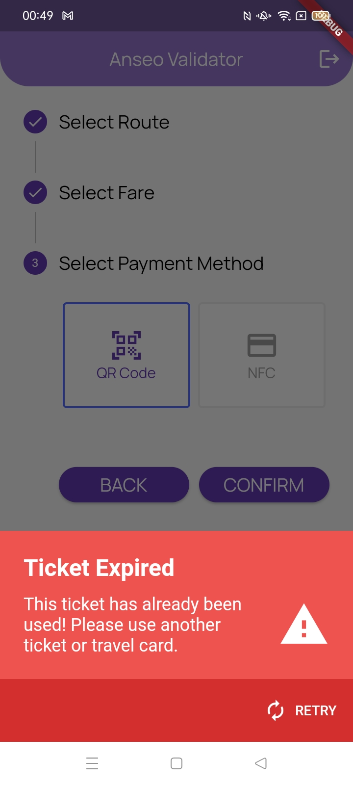

<div align="center">
  <!--  -->
  <h1>Anseo Validator</h1>
  
</div>

---

<div align="center">
  <h4>
    <a href="../Video Demonstration">View Demo</a>
    <span> · </span>
    <a href="https://anseo.gitbook.io/anseo-documentation/">Documentation</a>
  </h4>
</div>

---

<!-- Table of Contents -->

# :notebook_with_decorative_cover: Table of Contents

- [Features](#dart-features)
- [Getting Started](#toolbox-getting-started)
- [Screenshots](#iphone-screenshots)

  - [Authentication](#one-authentication)
  - [Select Options](#two-select-options)
  - [QR Code](#three-qr-code)
  - [NFC](#four-nfc)
  - [Display Transactions](#five-display-transactions)

- [Directory Structure](#file_folder-directory-structure)
- [System Design](#triangular_ruler-system-design)
  - [Methodology](#traffic_light-methodology)
  - [Three Tier Architecture](#office-three-tier-architecture)
  - [Database](#cd-database)
  - [USE Case](#performing_arts-use-case)
  - [Colour Scheme](#art-colour-scheme)
- [Plugins](#electric_plug-plugins)
- [Development Process](#construction-development-process)

---

<!-- Features -->

## :dart: Features

- [x] Select the route, fare type and payment method
- [x] Scan NFC travel cards and decrypt the data within the NFC travel card
- [x] Scan QR codes and decrypt the data within the QR code
- [x] Create/Update transactions to the Firebase Cloud Firestore database and display results to user

---

<!-- Getting Started -->

## :toolbox: Getting Started

Have a look at the documentation [here](https://anseo.gitbook.io/anseo-documentation/) to get started.

---

<!-- Screenshots -->

## :iphone: Screenshots

<!-- Authentication -->

### :one: Authentication

|                          Splash Screen                          |                         Landing Page                          |                       Sign In                       |                       Sign Up                       |
| :-------------------------------------------------------------: | :-----------------------------------------------------------: | :-------------------------------------------------: | :-------------------------------------------------: |
|  |  |  |  |

<!-- Select Options -->

### :two: Select Options

|                           Select Options 1                            |                           Select Options 2                            |
| :-------------------------------------------------------------------: | :-------------------------------------------------------------------: |
|  |  |

<!-- QR Code -->

### :three: QR Code

|                          QR Code Scan 1                           |                          QR Code Scan 2                           |
| :---------------------------------------------------------------: | :---------------------------------------------------------------: |
|  |  |

<!-- NFC -->

### :four: NFC

|                        NFC Scan 1                         |                        NFC Scan 2                         |
| :-------------------------------------------------------: | :-------------------------------------------------------: |
|  |  |

<!-- Display Transactions -->

### :five: Display Transactions

|                             Display Transaction                             |                               Expired                                |
| :-------------------------------------------------------------------------: | :------------------------------------------------------------------: |
|  |  |

---

<!-- Directory Structure -->

## :file_folder: Directory Structure

<details>
     <summary> Anseo Validator </summary>
  
```
|-- lib
|   |-- config
|   |   '-- extensions.dart
|   |-- models
|   |   |-- account.dart
|   |   |-- radio_model.dart
|   |   |-- record.dart
|   |   '-- routes.dart
|   |-- pages
|   |   |-- account
|   |   |   |-- landing_page.dart
|   |   |   |-- sign_in.dart
|   |   |   '-- sign_up.dart
|   |   |-- display_transaction.dart
|   |   |-- ndef_record.dart
|   |   |-- nfc_scan.dart
|   |   '-- select_option_for_driver.dart
|   |-- services
|   |   |-- aes_encryption.dart
|   |   |-- firebase_auth.dart
|   |   '-- firebase_database.dart
|   |-- widgets
|   |   '-- radio_item.dart
|   |-- firebase_wrapper.dart
|   '-- main.dart
|-- assets
|   |-- icons
|   |   '-- verified.png
|   |-- logo
|   |   '-- logo1_black.png
|   |-- dublinBusRoutes.json
|   |-- goAheadRoutes.json
|   |-- iarnrodEireannRoutes.json
|   '-- luasRoutes.json
|-- pubspec.yaml
```

</details>

---

<!-- System Design -->

## :triangular_ruler: System Design

### :traffic_light: Methodology

Feature Driven Development (FDD), a part of the Agile Methodology, organizes software development around making progress on features in a systematically manner. This was the chosen methodology used in this application as FDD supports the dynamic evolvement of a feature including the inclusion and/or removal of designs and code, and the overall direction of the project.

Given how this project has multiple features to develop, it will allow for each feature to be developed thoroughly with a specific timeframe using sub-features.

To compensate for the potential decrease in documentation, a daily log with all the progress made regarding each feature will be written out whenever a development is being carried out.

Using GitHub as the choice for version control will also provide documentation on any changes that has occurred.

---

### :office: Three Tier Architecture

Anseo Validator is build upon a three-tier architecture model, as show above. With three-tier architecture, it's advantageous in that any changes made to one tier shouldn’t affect any other tiers in theory. The diagram shows the entities within each layer

<div align="center"> 
  
</div>

---

### :cd: Database

Firebase Cloud Firestore, a NoSQL database, will be implemented to allow the driver to store their information on their account. A field of particular interest for would be the name of the transit operator that the drive works for. This will be used to display the relevant routes pertaining to the operator. The following Entity Relationship Diagram highlight the fields necessary to create the database.

<div align="center"> 
  
</div>

---

### :performing_arts: USE Case

Use Case Diagrams were created to represent the how the system would behave in line with the users interaction. It demonstrates the compulsory and extendable functionality that is applicable to the user when interacting with the system. In this case there is three actors – the commuter, the bus driver/operator and the admin. Each actor has access to certain functionalities and may share common functionalities with other actors.

<div align="center"> 
  
</div>

---

### :art: Colour Scheme

<h4> Main Application </h4>

| Color            | Hex                                                                                                                                    |
| ---------------- | -------------------------------------------------------------------------------------------------------------------------------------- |
| Primary Color    |  #673AB7                                                                       |
| Secondary Color  |  #9575CD                                                                       |
| Background Color |  #FFFFFF                                                                       |
| Accent Color     |  #9FA8DA                                                                       |
| Icon Gradient    |  #1A6DFF </br> #C822FF |
| Text Color       |  #000000                                                                       |

---

<h4>Travel Cards</h4>

| Color               | Hex                                                                                                                                                                                                          | Result                                                                                  |
| ------------------- | ------------------------------------------------------------------------------------------------------------------------------------------------------------------------------------------------------------ | --------------------------------------------------------------------------------------- |
| Student Travel Card |  #4158D0 </br> #C850C0 </br> #FFCC70 |  |
| Adult Travel Card   |  #0061FF </br>  #60EFFF                                                                      |      |
| Child Travel Card   |  #8EC5FC </br> #E0C3FC                                                                       |      |

---

<h4>Logo</h4>

<table>
<tr><th>Colour</th><th>Result</th></tr>
<tr><td>

| Color           | Hex                                                                                                                               |
| --------------- | --------------------------------------------------------------------------------------------------------------------------------- |
| Logo Background |  #000000                                                                  |
| Logo Text       |  #4158D0  #C850C0 |

</td><td>


</td></tr> </table>

---

<!--Plugins -->

## :electric_plug: Plugins

| Name                                                                            | Version  | Usage                                                                                                                           |
| ------------------------------------------------------------------------------- | -------- | ------------------------------------------------------------------------------------------------------------------------------- |
| [**encrypt**](https://pub.dev/packages/encrypt)                                 | ^5.0.1   | Generate cryptographically secure random keys and IVs                                                                           |
| [**flutter_barcode_scanner**](https://pub.dev/packages/flutter_barcode_scanner) | ^2.0.0   | Barcode / QR Code scanning support on Android and iOS                                                                           |
| [**firebase_core**](https://pub.dev/packages/firebase_core)                     | ^1.12.0  | Enables connecting to multiple Firebase apps                                                                                    |
| [**firebase_auth**](https://pub.dev/packages/firebase_auth)                     | ^3.3.6   | Enabling Android and iOS authentication using passwords, phone numbers and identity providers like Google, Facebook and Twitter |
| [**cloud_firestore**](https://pub.dev/packages/cloud_firestore)                 | ^3.1.9   | Use the Cloud Firestore API a cloud-hosted, noSQL database with live synchronization                                            |
| [**nfc_manager**](https://pub.dev/packages/nfc_manager)                         | ^3.1.1   | Accessing the NFC features on Android and iOS                                                                                   |
| [**provider**](https://pub.dev/packages/provider)                               | ^6.0.2   | Dependency injection and state management                                                                                       |
| [**sweetsheet**](https://pub.dev/packages/sweetsheet)                           | ^0.4.0   | Show beautiful bottom sheet as confirmation dialog                                                                              |
| [**google_fonts**](https://pub.dev/packages/google_fonts)                       | ^2.3.1   | Use fonts from fonts.google.com                                                                                                 |
| [**flutter_native_splash**](https://pub.dev/packages/flutter_native_splash)     | ^2.1.2+1 | Customize Flutter's default white native splash screen with background color and splash image                                   |
| [**flutter_launcher_icons**](https://pub.dev/packages/flutter_launcher_icons)   | ^0.9.2   | Updating application launcher icon                                                                                              |

---

<!-- Usage -->

## :construction: Development Process

The documentation process for Anseo Validator can be viewed [here](https://anseo.gitbook.io/anseo-documentation/)
